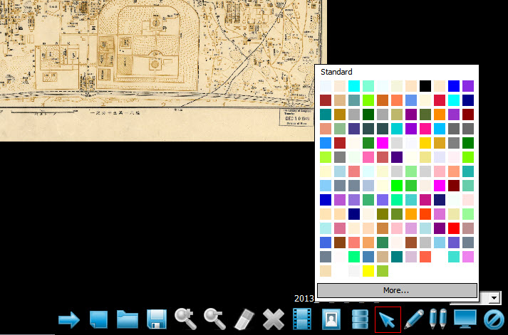

# qboard
交互式教学培训系统 - 使用QT/C++开发的画板程序 (支持直接在Office文档、图片、视频上面涂抹和绘画）

## 主要功能
1. 画板可以分很多页，每个页里可以有很多对象，对象支持：图片、画笔（单笔，连笔）、视频、OFFICE对象
2. 支持直接打印Office文档（WORD,EXCEL,PPT）生成多页的画板文件
3. 可以直接在画板上用铅笔自由绘画
4. 视频，OFFICE对象可以直接打开查看或播放，对象可以移动，伸缩、旋转，可以对象内绘图等。
5. 支持将一个文件夹生成一个U盘上的独立文件，这个文件只允许画板程序打开，可以直接嵌入成为画板中的对象

## 软件截图

## 联系我
如果您有任何需要或者疑问，请与我联系：QQ（81224865），电子邮件：tiger.hu.liu@gmail.com